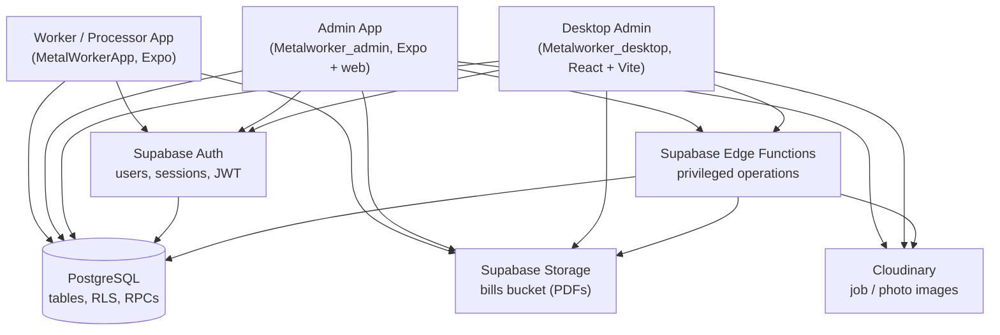

# Metalworker Management System

A multi-application management system for a metal fabrication / job-work workshop.
It covers workforce (workers and processors), jobs, folders, drawings, photos,
dispatch, bill groups, and a full tax-invoice (Bills) pipeline with PDF generation
and per-folder financial analysis.

This repository contains **one system with three front ends**, not three unrelated
projects. All three talk to the same Supabase project and the same database.

| Application | Stack | Audience |
| --- | --- | --- |
| `MetalWorkerApp/` | Expo SDK 57 (React Native) | Worker / Processor mobile app |
| `Metalworker_admin/` | Expo SDK 57 (React Native + web) | Administrative app |
| `Metalworker_desktop/` | React + Vite | Desktop / browser administrative app |

`Metalworker_admin` and `Metalworker_desktop` are **parity clients**: they implement
the same screens and the same services against the same schema, and share naming
deliberately so either can be maintained by someone who knows the other.

---

## Table of contents

- [Architecture](#architecture)
- [Application structure](#application-structure)
- [Major features](#major-features)
- [Bills architecture](#bills-architecture)
- [Bill editing](#bill-editing)
- [Billing folders](#billing-folders)
- [Billing analytics](#billing-analytics)
- [Bulk operations](#bulk-operations)
- [Authentication and roles](#authentication-and-roles)
- [Database and migrations](#database-and-migrations)
- [Supabase Edge Functions](#supabase-edge-functions)
- [Local development](#local-development)
- [Environment variables](#environment-variables)
- [Testing](#testing)
- [CI (GitHub Actions)](#ci-github-actions)
- [Deployment](#deployment)
- [Test fixtures](#test-fixtures)
- [Known limitations](#known-limitations)
- [Security notes](#security-notes)

---

## Architecture



### Responsibilities

| Component | Responsibility |
| --- | --- |
| **Frontend clients** | Screens, interaction and presentation. Business rules that must be trusted live in the database or Edge Functions, not in the UI. |
| **Supabase Auth** | Identity. Accounts are created by an admin and carry a role (`worker`, `processor`, `admin`) and an `is_active` flag on the `profiles` table. |
| **PostgreSQL** | The system of record. Tables hold the data; **Row Level Security** decides what each role may read or write; **RPC functions** implement multi-statement operations transactionally. |
| **Supabase Storage** | Holds generated bill PDFs in the `bills` bucket. Bill PDFs are written only by the Edge Function that renders them. |
| **Edge Functions** | Server-side privileged operations that need the service-role key: Excel parsing, PDF rendering, user creation/deletion, Cloudinary deletions, username changes. All seven verify the caller is an authenticated, **active admin**. |
| **Cloudinary** | Image hosting for job and site photos. Uploads use an unsigned upload preset from the clients; deletion of an asset requires the API secret and therefore happens server-side. |

> The service-role key exists **only** in the Edge Functions runtime. It is never
> present in any client bundle.

---

## Application structure

```
MetalWorkerApp/                 Worker / Processor mobile app
Metalworker_admin/              Administrative app
Metalworker_desktop/            Desktop / browser administrative app
.github/workflows/ci.yml        Continuous integration
```

Inside each app, `src/` holds `app/` (Expo Router routes) or `pages/`, plus
`services/`, `components/`, `hooks/`, `types/` and `utils/`. **Business and data
access live in `services/`, not in components.**

### Backend structure — `Metalworker_admin/supabase/`

| Path | Purpose |
| --- | --- |
| `migrations/` | Numbered SQL migrations. Each is the authoritative record of a database change. |
| `functions/` | Supabase Edge Functions — server-side privileged and business operations. |
| `functions/_selftest/` | Node-runnable verification of the bill pipeline. Not deployed. |
| `functions/process-bill-upload/_shared/` | The parser and PDF renderer, shared by the two bill functions. |
| `.temp/` | Local Supabase CLI link state. Generated; never committed. |

Migrations are applied in numeric order and are the only supported way to change
the schema. Edge Functions are deployed separately from the database — see
[Deployment](#deployment).

---

## Major features

**Workforce**
- Worker and processor management (create, edit, deactivate, delete)
- Role-based access and per-user active/inactive state
- Authentication for all three apps

**Work and job records**
- Jobs, split into **Labour jobs** and **With Metal jobs**, plus a **General** kind
- Excel job import (`jobImport` / `jobImportParser` in the desktop app)
- Job drawings, with a single **primary drawing** per job
- Drawing groups
- Photos and photo groups, with Cloudinary-backed uploads
- Dispatch and dispatch detail

**Organisation**
- Folders holding jobs, drawings, photos and bills
- Reordering within a folder, transactionally
- Bill groups (grouping bills independently of folders)

**Bills**
- Excel bill ingestion (tax-invoice workbooks)
- Flexible **1/2/3-copy** parsing — see [Bills architecture](#bills-architecture)
- PDF generation, three labelled copies per bill
- Per-bill PDF generation (each bill owns its own documents)
- Bill editing with PDF regeneration
- Billing folders, with per-folder analysis and export
- Bulk bill actions (delete, add to folder, remove, move)
- Audit logging of administrative actions

---

## Bills architecture

### The one invariant

```
1 physical invoice  =  1 bill database record  =  3 printable PDF copies
```

`ORIGINAL`, `DUPLICATE` and `TRIPLICATE` are **three physical print copies of a
single financial bill**. They are *not* three bills and are never three database
rows.

This is enforced structurally rather than by convention:

- The parser produces **one `bills` row per worksheet** (`process-bill-upload/_shared/parseBill.ts`).
- The three copies are retained as rendering variants of that one row.
- Because there is only ever one row per invoice, folder totals *cannot* triple
  anything. There is no multiplier in the aggregation, and none can be added by
  accident because there is nothing to multiply.

The three PDFs live on the bill itself as `original_pdf_path`,
`duplicate_pdf_path` and `triplicate_pdf_path` (migration `0007`), so deleting one
bill never touches a sibling's documents.

### Flexible copy handling

The Excel author is **not** required to prepare all three blocks. A sheet may
contain:

- `ORIGINAL` only
- `DUPLICATE` only
- `TRIPLICATE` only
- any combination of the above

Only **one** recognisable copy block is required. Missing copies are
**synthesised** by cloning the canonical parse, so output is always the complete
`ORIGINAL` / `DUPLICATE` / `TRIPLICATE` set. Which blocks were present is recorded
per **sheet**, so one workbook may freely mix a single-copy sheet with a
three-copy sheet.

Two consequences hold in every case:

1. **Financial values remain one bill.** Synthesis adds print copies, never money.
2. **Generated PDFs are labelled correctly** — a synthesised `DUPLICATE` is
   labelled `DUPLICATE`, not `ORIGINAL`.

Parsing is also **non-positional**: the row span of each copy is discovered from
its copy labels, and every field is found by its label text rather than a
hard-coded row or column. Label matching uses a squashed form (upper-cased,
non-alphanumerics removed), so `D E S C R I P T I O N`, `Total Amount :GST` and
`TOTAL AMOUNT AFTER TAX` all resolve correctly.

### Where this logic lives

Parsing and PDF rendering are **centralised in Supabase Edge Functions**, not
implemented separately in the two client apps:

| Module | Role |
| --- | --- |
| `process-bill-upload/_shared/xlsx.ts` | Minimal `.xlsx` reader (no dependency) |
| `process-bill-upload/_shared/parseBill.ts` | Workbook → one `Bill` per sheet, with copies |
| `process-bill-upload/_shared/billDocument.ts` | The renderable document model |
| `process-bill-upload/_shared/renderBill.ts` | PDF drawing |
| `process-bill-upload/_shared/pdf.ts` | Low-level PDF writer |
| `process-bill-upload/_shared/fontMetrics.ts` | Helvetica advance widths |
| `process-bill-upload/_shared/formatJobKind.ts` | Job-kind display normalisation |
| `process-bill-upload/_shared/billEdit.ts` | Edit merge, validation, derived figures |

Both the browser admin and the mobile admin call the same function, which is the
only way to guarantee byte-identical documents from the same workbook without
shipping two parsers that must be kept in step.

---

## Bill editing

A bill can be corrected after import and re-printed, without re-uploading the
workbook. Migration `0008` stores the **full render model** — recipient address
lines, seller header lines, tax *rates* as well as amounts, footer certification
and signature wording — because the renderer needs more than a summary and a PDF
regenerated later would otherwise silently lose fields.

| Concern | Behaviour |
| --- | --- |
| Editable data | Bill header, financial figures and line items (`bill_line_items`) |
| Derived figures | Recomputed and validated server-side from the merged patch |
| Versioned PDFs | `pdf_version` increments per save; objects are stored as `<upload>/<bill>_<token>_v<N>_<copy>.pdf`, so a new version is a new URL and the previous objects are removed once the new row is written |
| `updated_at` / `updated_by` | Set on every save; `updated_by` references `auth.users` |
| Audit logging | An entry is written for the edit |
| Failure / restore | `update-bill` saves the previous state first and **restores** the bill and its line items if any later step fails, so a save that reports failure leaves nothing changed |

All columns added by `0008` are additive and nullable. A row written before `0008`
regenerates with sensible fallbacks rather than invented values, and empty stays
empty — the renderer keeps the row and its border.

---

## Billing folders

Billing folders are a **first-class folder kind**, distinct from Labour, With Metal
and General job folders. A Billing folder contains **Bills only**.

This is a database invariant, not a UI convention:

- `admin_folders.folder_type = 'billing'` — allowed values are
  `labour`, `with_material`, `general`, `billing`
- `folder_items.item_type = 'bill'`
- A `BEFORE INSERT OR UPDATE` trigger, `enforce_billing_folder_items`, named
  `billing_folder_items_only_bills`, rejects a non-bill item being placed into a
  folder whose `folder_type` is `billing`

The trigger deliberately does **not** fire on `DELETE`, so emptying or removing a
folder is never blocked.

Billing folders reuse the existing folder engine — the same `admin_folders` table,
the same `folder_items` link table, and the `(folder_id, item_type, item_id)`
uniqueness index from migration `0001`. No second folder system was introduced.

**Supported operations:** create, rename, delete, open, add bills, remove bills,
move bills between folders, empty folder, select multiple, select all, select all
matching, and folder-level analysis with export.

---

## Billing analytics

A folder summary is computed **in the database** by the
`get_folder_bill_summary(folder_id)` RPC (migrations `0006`, `0009`, `0010`), so
there is exactly one implementation and the clients only render it. A second RPC,
`get_billing_folder_bill_counts()`, returns per-folder bill counts for the folder
list.

| Figure | Population |
| --- | --- |
| Bill count | all bills |
| Total quantity | all bills |
| Total before tax | bills with a total |
| Total CGST / SGST / IGST / GST | bills with a total |
| Total after tax | bills with a total |
| Round off | bills with a total |
| Averages of every money figure | bills with a total |
| Average quantity | all bills |
| Min / max after tax and before tax | bills with a total, `NULL` if none |
| Bills with a total / bills without a total | both reported separately |
| Job-kind breakdown | all bills |

### How missing totals are handled

A bill's financial columns are nullable by design — a template may legitimately
omit a field. A bill with no grand total therefore has
`amount_after_tax IS NULL`.

Migration `0010` makes each aggregate's population **explicit**:

- **valid bills** = bills where `amount_after_tax IS NOT NULL`. A stored `0` **is**
  a valid total (a genuinely free invoice); `NULL` is not.
- **all bills** = every distinct bill in the folder.

Money totals and money averages use **valid bills**. Bill count, quantity and
job-kind breakdown use **all bills**.

This is deliberate. Every money figure is one term in the identity
`amount_before_tax + total_gst + round_off = amount_after_tax`. Mixing bills that
contribute to one term but not another produces a number describing no invoice, so
money is taken only from bills whose whole identity is known.

Two consequences worth stating plainly:

- `min_*` and `max_*` are **nullable**. A folder with no bills carrying a total
  reports "no value", not `₹0.00`. Missing is never shown as zero.
- `avg_bill_value` was **corrected** by `0010`. Previously it divided by
  `total_bills`, which diluted the mean with bills that have no total at all.

Both clients render a scope note above the figures stating how many bills are
excluded and on what basis, so an incomplete dataset is always visible on screen.
Aggregation operates on unique bill records, so PDF copies are never counted as
additional financial records.

---

## Bulk operations

Bulk bill actions — delete, add to folder, remove from folder, and move — all
accept a set of bills and report progress truthfully.

| Behaviour | Detail |
| --- | --- |
| **Select all** | Selects the bills on the current page. |
| **Select all matching** | Selects the bills matching the current filters. The UI states the scope explicitly (e.g. "All 247 matching bills selected") rather than inferring it. |
| **Selection scope** | Tracked as an explicit mode (`none` / `page` / `all_matching`), not inferred from array length. |
| **Large selections** | Resolved through a paginated id query rather than loading every row into the browser. |
| **Progress** | Real `done / total`, rendered as e.g. **`Deleting 18 / 37`**. |
| **Failures** | Surfaced per bill with a label and the error. Never silently ignored. |

Progress is **never invented**. A caller that has a genuine `done / total` shows
the counted bar; a caller that does not gets an indeterminate bar and
"Please wait...". There is no timer or eased animation standing in for real work,
because a percentage not backed by completed work is misleading. Bulk delete
currently runs **sequentially** precisely because that is the only approach that
produces an honest count.

---

## Authentication and roles

Roles are defined in `types/profile.ts` as:

| Role | Purpose |
| --- | --- |
| `worker` | Workshop floor worker |
| `processor` | Processor |
| `admin` | Administrator — the only role permitted to create users, edit bills, or manage folders and stock |

Accounts are created by an admin through the `create-user` Edge Function. It
accepts only `worker` or `processor`; `admin` is never assigned through the UI, so
an administrator cannot accidentally elevate another administrator by a normal
path.

**Flow.** A user signs in through Supabase Auth and receives a JWT. Clients use
the **anon key** to call PostgREST, Storage and Edge Functions as that identity.
Row Level Security enforces what the role may read or write. Operations requiring
the service-role key are moved server-side into an Edge Function, which first
re-reads the caller's `profiles` row and confirms `role = 'admin'` **and**
`is_active = true` before doing anything.

`delete-worker` additionally refuses to delete an admin account.

All seven Edge Functions implement this active-admin gate. A frontend guard is
belt-and-braces only; the real authorization lives in the database and the
functions.

---

## Database and migrations

| Migration | Purpose |
| --- | --- |
| `0001_folder_items_unique.sql` | Unique index on `folder_items (folder_id, item_type, item_id)`. First consolidates any pre-existing duplicate triples, keeping the earliest row, so the index can be created. |
| `0002_set_primary_drawing.sql` | Transactional `set_primary_drawing` RPC, replacing a client-side two-update sequence that could leave a job with 0 or 2 primary drawings. |
| `0003_admin_audit_log.sql` | The `admin_audit_log` table — who did what to which target and when — plus an insert-only policy for active admins and a deny-read policy. |
| `0004_reorder_folder_items.sql` | Transactional `reorder_folder_items` RPC. Rewrites all positions in one transaction and refuses a partial or mismatched id set. |
| `0005_bills.sql` | The Bills schema: `bill_uploads`, `bills`, `bill_line_items`. One bill per worksheet, with the three copies as print variants. |
| `0006_folder_bill_summary.sql` | `get_folder_bill_summary` RPC — per-folder counts and totals, summing distinct bill rows. |
| `0007_bill_pdfs_per_bill.sql` | Moves the three PDF paths from `bill_uploads` down to `bills`, so each bill owns its own documents. Fixes a workbook-level PDF being offered on every bill. |
| `0008_bill_editing.sql` | Everything bill editing needs: the full render model, line-item ordering, `pdf_version`, `updated_at`, `updated_by`. |
| `0009_billing_folders.sql` | `folder_type = 'billing'`, the `billing_folder_items_only_bills` trigger, an extended `get_folder_bill_summary`, and `get_billing_folder_bill_counts()`. |
| `0010_billing_summary_semantics.sql` | Makes each summary figure's population explicit, adds `bills_with_total`, makes `min_*`/`max_*` nullable, and corrects `avg_bill_value`. |

Several RPCs are `SECURITY DEFINER` with a pinned `search_path` and an explicit
`REVOKE`/`GRANT`, so they are not exposed to `public` by default.

---

## Supabase Edge Functions

All seven are administrative/privileged: each resolves the caller from their JWT
and rejects anything that is not an authenticated, active admin.

| Function | Purpose |
| --- | --- |
| `create-user` | Creates an auth account for a `worker` or `processor` and the matching `profiles` row. Validates the role server-side. |
| `delete-worker` | Removes a worker's or processor's auth account and related rows. **Refuses admin targets.** May return a `warning` when the account is removed but a related cleanup step did not succeed, so the admin can be told a row may need manual attention. |
| `update-worker-username` | Changes a worker's or processor's username, enforcing uniqueness. |
| `get-admin-dispatches` | Returns dispatch data for the admin view, including signed Cloudinary URLs, using the Cloudinary API secret server-side. |
| `delete-cloudinary-asset` | Deletes a Cloudinary asset. Requires the Cloudinary API secret, so it cannot be done from a client. |
| `process-bill-upload` | Turns one uploaded workbook into the relational bill rows **and** the three print-ready PDFs per bill. Stores PDFs in the `bills` bucket. |
| `update-bill` | Saves one edited bill and re-prints its three copies at a new `pdf_version`. Restores the previous state if any step fails. |

Server-side environment variables (set in the Supabase project, never in a client):

| Variable | Used by |
| --- | --- |
| `SUPABASE_URL` | all functions |
| `SUPABASE_ANON_KEY` | all functions |
| `SUPABASE_SERVICE_ROLE_KEY` | all functions — **privileged, server-side only** |
| `CLOUDINARY_CLOUD_NAME` | `delete-cloudinary-asset`, `get-admin-dispatches` |
| `CLOUDINARY_API_KEY` | `delete-cloudinary-asset`, `get-admin-dispatches` |
| `CLOUDINARY_API_SECRET` | `delete-cloudinary-asset`, `get-admin-dispatches` — **secret** |

---

## Local development

**Prerequisites**

| Requirement | Notes |
| --- | --- |
| Node.js | **22.13.x or newer** — the minimum for Expo SDK 57 |
| npm | Ships with Node |
| Supabase CLI | Only needed for migrations, Edge Functions and `supabase link` |
| Git | — |

Both Expo apps are pinned to **Expo SDK 57** (`expo` 57.0.18 in the admin app,
57.0.17 in the worker app), React Native 0.86 and React 19.2.3. See the
[SDK 57 reference](https://docs.expo.dev/versions/v57.0.0/).

### Clone and install

```bash
git clone <repository-url>
cd <repository>

cd MetalWorkerApp      && npm install
cd ../Metalworker_admin && npm install
cd ../Metalworker_desktop && npm install
```

### Worker / Processor app

```bash
cd MetalWorkerApp
npm install
npm start          # expo start — press i / a / w, or scan the QR code with Expo Go
```

Other scripts: `npm run android`, `npm run ios`, `npm run web`, `npm run lint`.

### Admin app

```bash
cd Metalworker_admin
npm install
npm run web        # expo start --web — opens the admin app in a browser
npm start          # expo start — same app on a device or simulator
```

Other scripts: `npm run lint`, `npm run lint:edge`, `npm run bills:selftest`.

For a production web build:

```bash
npx expo export --platform web     # writes to dist/
```

### Desktop app

```bash
cd Metalworker_desktop
npm install
npm run dev        # vite dev server
npm run build      # tsc -b && vite build
npm run preview    # serve the production build
```

### Environment files

Each app reads a local `.env`. All three `.env` files are git-ignored and none are
committed. Create the file for the app you are running, using the variable names
in [Environment variables](#environment-variables).

---

## Environment variables

No values are given here, and none should be committed. Create a `.env` in each app.

### Admin and Worker apps (Expo)

| Variable | Used by | Purpose |
| --- | --- | --- |
| `EXPO_PUBLIC_SUPABASE_URL` | both | Supabase project URL |
| `EXPO_PUBLIC_SUPABASE_ANON_KEY` | both | Public anon key used to authenticate as the signed-in user |
| `EXPO_PUBLIC_CLOUDINARY_CLOUD_NAME` | both | Cloudinary cloud name |
| `EXPO_PUBLIC_CLOUDINARY_UPLOAD_PRESET` | both | Unsigned upload preset |

> **Anything prefixed `EXPO_PUBLIC_` is inlined into the client bundle** and is
> therefore public. Never put a secret in one. These four values must be the
> public anon key and an unsigned upload preset.

### Desktop app (Vite)

| Variable | Used by | Purpose |
| --- | --- | --- |
| `VITE_SUPABASE_URL` | desktop | Supabase project URL |
| `VITE_SUPABASE_ANON_KEY` | desktop | Public anon key |
| `VITE_CLOUDINARY_CLOUD_NAME` | desktop | Cloudinary cloud name |
| `VITE_CLOUDINARY_UPLOAD_PRESET` | desktop | Unsigned upload preset |

> `VITE_*` variables are also embedded in the client bundle at build time. Same
> rule: public values only.

### Server-side only

`SUPABASE_SERVICE_ROLE_KEY`, `CLOUDINARY_API_KEY` and `CLOUDINARY_API_SECRET`
belong **only** in the Supabase Edge Functions environment (project settings, or
`supabase secrets set`). They must never appear in a client `.env`, in a client
bundle, or in this repository. The service-role key bypasses Row Level Security —
treat it as equivalent to full database administrator access.

---

## Testing

### Bill pipeline self-tests

```bash
cd Metalworker_admin
npm run bills:selftest
```

Runs **11 suites** against real workbooks, on Node, with no deployment required:

| Suite | Covers |
| --- | --- |
| `test-copies.ts` | Flexible copy handling — which blocks are present, synthesis of missing copies |
| `test-parse.ts` | Workbook → bills; every sheet becomes a bill; cross-copy agreement |
| `test-pdf.ts` | PDF generation — validity, page attribution, one content stream per page |
| `test-per-bill.ts` | Per-bill PDF generation and the one-PDF-set-per-bill rule |
| `test-edit.ts` | Bill editing, patch merge, validation, derived figures |
| `test-jobkind.ts` | Job-kind classification and its display label |
| `test-structure.ts` | Structural fidelity — empty fields keep their rows and columns |
| `test-billing-folders.ts` | Billing-folder aggregation, including missing-total semantics |
| `test-folder-summary-export.ts` | Exported figures are string-identical to the on-screen figures; cross-client parity |
| `test-audit-log.ts` | Every `admin_audit_log` insert uses real columns; no client read policy exists |
| `audit.ts` | Layout audit of a generated PDF — overlaps, alignment, off-page marks |

Each script writes its own `PASS` / `FAIL` lines and ends with a
`… CHECKS:` verdict. See `Metalworker_admin/supabase/functions/_selftest/README.md`
for detail, including the diagnostic and probe scripts (`probe-*.ts`,
`dump-sheet.ts`, `diff-roundtrip.ts`, `serve.ts`).

### Admin app checks

```bash
cd Metalworker_admin
npx tsc --noEmit -p tsconfig.json   # typecheck
npm run lint                       # expo lint
npm run lint:edge                  # typecheck the Edge Functions (Deno-flavoured)
npx expo export --platform web     # production web build
npm run bills:selftest             # the 11 suites above
```

### Desktop app checks

```bash
cd Metalworker_desktop
npx tsc -b         # typecheck
npm run build      # typecheck + production build
npm run lint       # eslint .   — currently fails; see Known limitations
```

---

## CI (GitHub Actions)

`.github/workflows/ci.yml` runs three jobs. It contains no `continue-on-error`, no
`|| true`, and no lint rule is muted — every step is a real gate. It deploys and
publishes nothing, and needs no secret.

| Job | Checks | Status |
| --- | --- | --- |
| **Admin** | `tsc --noEmit`, `expo lint`, `lint:edge`, `expo export --platform web`, `bills:selftest` | ✅ passing |
| **Desktop** | `tsc -b`, `vite build` | ✅ passing |
| **Desktop** | `eslint .` | ❌ **failing** — 53 findings (49 errors, 4 warnings) across 25 files |
| **Repository hygiene** | no generated output tracked; all three XLSX fixtures present; no `supabase/.temp`; credential scan | ✅ passing |

### The desktop lint failure is real and known

It is **not** fully green, and this is deliberate. The 53 findings predate the CI
workflow and live in unrelated files — `jobImportParser.ts`, `JobsPage.tsx`,
`JobEditModal.tsx`, `useSidebar.tsx`, `StockPage.tsx` and others. The bulk are
`react-hooks/set-state-in-effect` (15), `no-explicit-any` (11) and
`react-refresh/only-export-components` (11).

The Billing work contributes **zero** findings. The step is left red rather than
suppressed, because a workflow that reports success while a check failed is worse
than no workflow.

### Credential scanning

The hygiene job scans the repository for service-role-shaped keys and JWTs. The
detector's pattern is assembled from fragments at runtime, so the complete
credential signature does not appear in the workflow's own source and the job does
not fail on itself. The step then **proves the detector still fires** by testing
it against a synthetic key and a synthetic JWT on every run — so the check cannot
silently rot into a no-op.

---

## Deployment

There is **no automated deployment pipeline**. Deployment is a deliberate,
ordered, manual sequence. The order matters: the schema, then the functions, then
the clients.

```bash
# 1. Get the code
git pull

# 2. Install
cd Metalworker_admin && npm install
cd ../Metalworker_desktop && npm install

# 3. Verify BEFORE changing anything
cd Metalworker_admin && npm run bills:selftest
cd .. && cd Metalworker_desktop && npm run build

# 4. Link the CLI to the target project (once per machine)
cd Metalworker_admin
supabase link --project-ref <your-project-ref>

# 5. See what migrations are pending
supabase migration list

# 6. Apply pending migrations
supabase db push

# 7. Deploy the Edge Functions that changed
supabase functions deploy create-user
supabase functions deploy delete-worker
supabase functions deploy update-worker-username
supabase functions deploy delete-cloudinary-asset
supabase functions deploy get-admin-dispatches
supabase functions deploy process-bill-upload
supabase functions deploy update-bill

# 8. Build and host the clients
cd Metalworker_admin    && npx expo export --platform web
cd ../Metalworker_desktop && npm run build
```

Notes

- `supabase db push` applies only migrations not yet recorded as applied. Always
  run `supabase migration list` first and read the output.
- Migration `0010` changes the summary figures a live folder returns. Clients read
  `bills_with_total` defensively, so an unapplied `0010` degrades safely, but the
  corrected averages and nullable min/max only take effect once it is applied.
- If the base schema predates this repository, migrations `0001`–`0004` assume it
  already exists. Apply against the right project.
- Never commit credentials; provide them through the deployment environment.

---

## Test fixtures

Three Excel workbooks are committed at the repository root and used by the bill
self-tests.

| File | Purpose |
| --- | --- |
| `SAMPLE.xlsx` | Two invoices in the production layout. The main parser and PDF acceptance fixture. |
| `BILL 301 TO.xlsx` | Twenty invoices in the production layout. The layout reference used to build the renderer against the real format. |
| `test-bills-sanitized.xlsx` | A **generated, sanitised** single-copy fixture (one `ORIGINAL` marker, no duplicate/triplicate). Built by `_selftest/make-fixture.ts` from a real workbook's layout with every identifying value replaced. Used by `test-copies.ts`. |

> ⚠️ **`SAMPLE.xlsx` and `BILL 301 TO.xlsx` contain real business data** — real
> company name, counterparty GSTIN, bank name, bank account number, IFSC code,
> phone numbers and e-mail addresses. They are required by the self-tests today,
> but they should not be published. See [Security notes](#security-notes).

`test-bills-sanitized.xlsx` is the model to follow: a generator
(`make-fixture.ts`) produces a structurally identical workbook with placeholder
values, and the real file is never committed.

---

## Known limitations

These are real, verified limitations of the current repository.

1. **Desktop ESLint backlog — 53 findings.** `npm run lint` in
   `Metalworker_desktop` fails. The findings predate the Billing work and are in
   unrelated files. Billing files are clean. The CI gate is intentionally left red
   rather than muted.
2. **Bulk bill delete is sequential.** It processes one bill per request so that
   `done / total` progress is truthful. Deleting a very large selection is
   therefore slow. A server-side batch delete has been considered but not built,
   because it would have to handle ownership, folder links, line items, PDFs,
   uploads, the audit trail, partial failure and authorization before it could
   honestly report progress.
3. **Migration `0010` is not yet applied to the linked project.** The corrected
   averages and nullable min/max are live-server changes. Clients degrade safely
   until it is applied, but the old figures persist.
4. **`admin_audit_log` cannot be read by clients.** Migration `0003` installs a
   deny-read policy, so the audit trail has no read surface in the admin apps.
   Viewing it requires a service-role path. Bill-level history is therefore not
   surfaced in the UI.
5. **The per-app READMEs are still the stock `create-expo-app` templates** and do
   not describe these projects. This root README is currently the real
   documentation.
6. **RLS for `profiles`, `folder_items` and `admin_folders` is not in this
   repository.** The base schema predates it, so those policies cannot be audited
   from this codebase.
7. **Client parity is by convention, not enforced by tooling.** `Metalworker_desktop`
   additionally has `jobImport`, `jobImportParser` and `cloudinaryCleanup`, which
   the admin app does not.

---

## Security notes

- **Never commit `.env` files.** All three are git-ignored. Keep it that way.
- **Never commit the Supabase service-role key.** It bypasses Row Level Security
  and is equivalent to full database administrator access. It belongs only in the
  Edge Functions environment.
- **`EXPO_PUBLIC_*` and `VITE_*` are public.** They are inlined into the client
  bundle. Use the anon key and an unsigned Cloudinary upload preset there, and
  nothing else. Setting a real secret in one of these variables publishes it.
- **Keep privileged work server-side.** Anything needing the service-role key or
  the Cloudinary API secret belongs in an Edge Function, which must re-verify the
  caller is an authenticated, active admin.
- **Rely on the database, not the UI.** Row Level Security and the
  `SECURITY DEFINER` RPCs are the real authorization. Client-side guards are
  convenience only.
- **Billing data is sensitive financial data.** Do not publish real workbooks. The
  committed `SAMPLE.xlsx` and `BILL 301 TO.xlsx` should be replaced with generated,
  sanitised fixtures before this repository is made public — follow the pattern
  already used by `make-fixture.ts`.
- **A committed secret is not removed by deleting it.** CI scans for
  credential-shaped strings, but rotation is the only real remedy if a key is ever
  exposed.